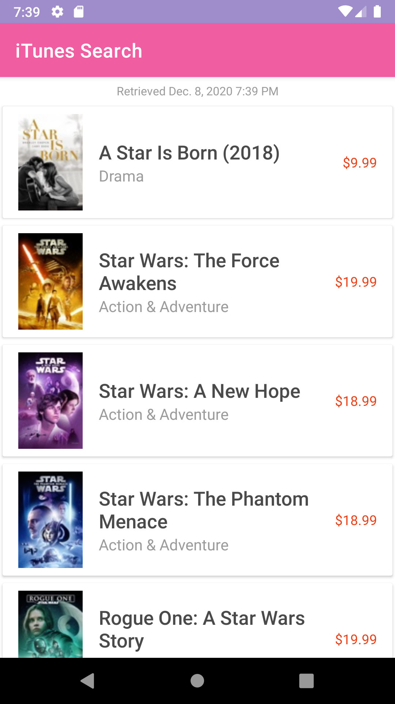
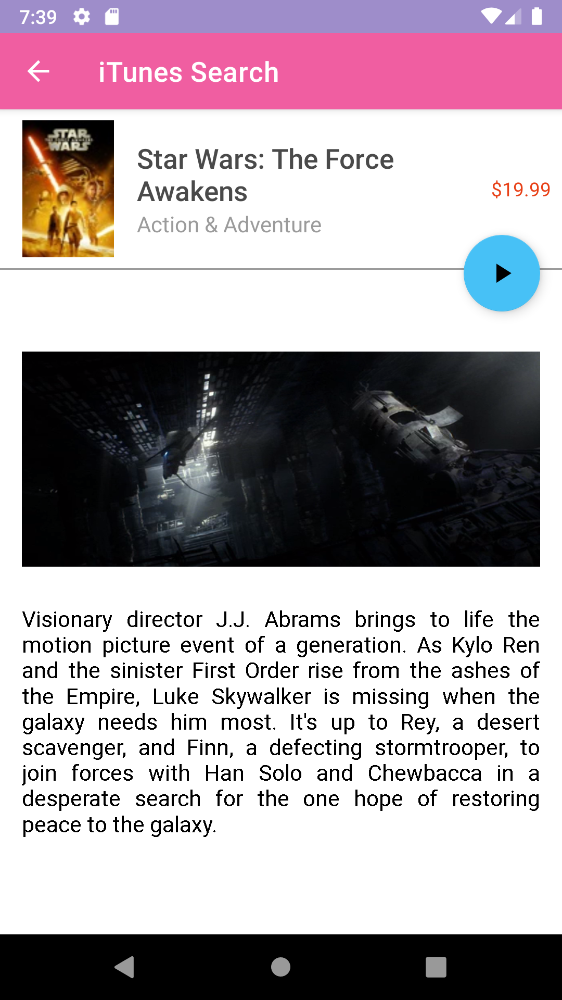
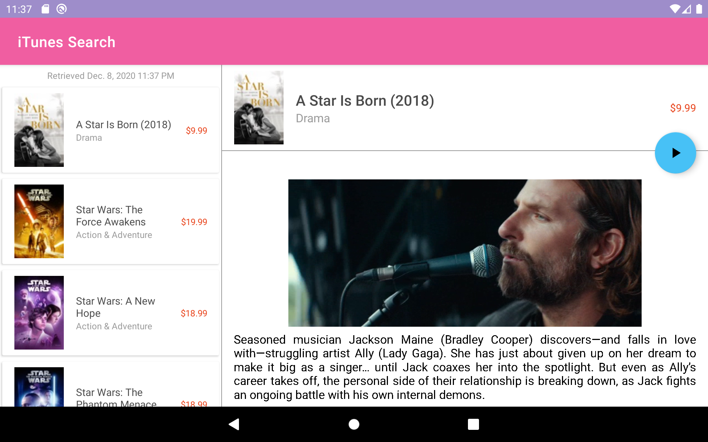

# iTunes Android
Demonstrate master detail app using Kotlin, MVVM, Retrofit, Room, RxJava, Dagger, and Data Binding.

## Screenshots
**Phone**

**Tablet**

## APK
[Download here.](https://drive.google.com/file/d/1sbjno5FPQKF-d98zbwg7jC9nZkWsgzZG/view?usp=sharing)

## Persistence
I used **Room** persistence library since it is easier to code, 
less prone to runtime error since it validates at
compile time, and works well with Rx for live data observation
as compared to SQLite.

## Architecture
I used **Model-View-ViewModel (MVVM)** since I am able to deliver
app functionality while writing significantly less code
especially when using it with Kotlin, Rx, and Android data binding.
MVVM allows the separation of view from business logic that 
makes the code easily testable, maintainable, and sustainable
which is especially helpful when multiple developers are working
on a single project and when adding new features.
